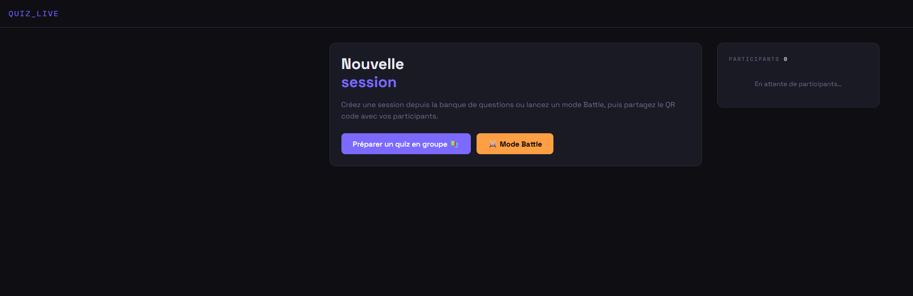
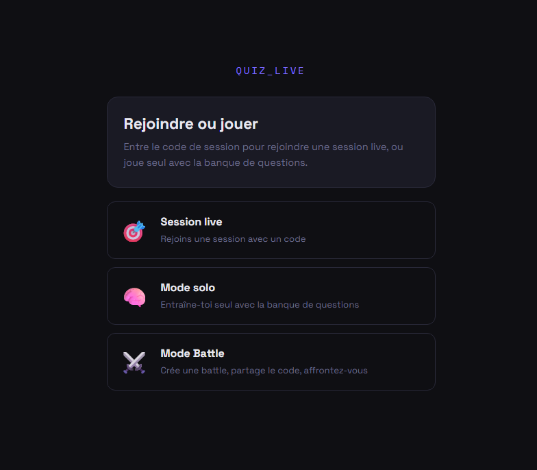
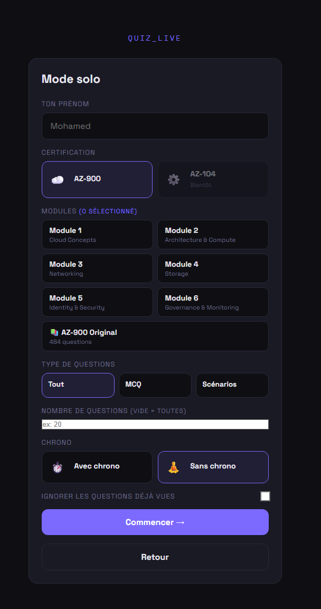

# Quiz Live — Real-time Kahoot-style quiz platform

A self-hosted, real-time quiz application built to help groups revise for the **Microsoft Azure AZ-900/104** certification. Trainers push questions live to a room of players, students practice solo at their own pace, or compete head-to-head in timed battles — all synced in real time over WebSockets.

Built end-to-end as a full DevOps exercise: from the FastAPI backend and the vanilla-JS frontend, to the containerized deployment on Azure with a complete CI/CD pipeline.

---

## What it does

Quiz Live runs three distinct game modes from a single 750+ question bank:

- **Group quiz (live)** — the trainer builds a quiz by picking modules and a number of random questions, shares a QR code, and pushes questions one by one. Players answer on their phones; results and the correct answer are revealed only when the trainer chooses.
- **Solo** — a student trains alone, self-paced, with instant feedback and an option to skip already-seen questions.
- **Battle** — self-paced multiplayer with a global timer and a final ranking (Kahoot-style tiebreak: highest score, then fastest time). Players who drop out are still scored on the full set.

The question bank covers the six AZ-900 modules (MCQ, multiple-answer, true/false, and exam-style scenarios) plus the 484-question official AZ-900 set.

---

## Screenshots

| Host — new session | Player — join screen | Solo setup |
|---|---|---|
|  |  |  |


---

## Tech stack

**Backend**
- **Python / FastAPI** — REST API + WebSocket endpoints
- **WebSockets** — real-time question push, live answer counts, resilient broadcast that survives dropped connections
- **SQLAlchemy** — ORM over the question bank
- **PostgreSQL** — managed Azure Database for PostgreSQL (Flexible Server)

**Frontend**
- **Vanilla HTML / CSS / JavaScript** — no framework, two single-page interfaces (`host.html`, `student.html`)
- QR-code session joining, auto-reconnecting WebSocket client with capped backoff

**Infrastructure & DevOps**
- **Docker** — single image, pushed to Docker Hub on every build
- **Azure Container Apps** — serverless container hosting (single-replica by design, see below)
- **GitHub Actions** — full CI/CD pipeline
- **OIDC** — passwordless authentication from GitHub Actions to Azure (federated credentials, no stored secrets)

---

## Architecture highlights

A few engineering decisions worth calling out, because they shaped the design:

**In-memory session state, single replica.** Live sessions (participants, answers, battle rosters) live in the app's memory rather than the database. This keeps latency low and the code simple, but it means the app must run as a single replica — multiple replicas would fragment session state and players would land on the wrong instance. The scaling limit is explicit and documented; scaling further would mean externalizing state to Redis and propagating WebSocket broadcasts across replicas.

**Resilient WebSocket broadcast.** Early on, a single dead socket in the broadcast loop would stop delivery for every player after it — so some players saw the question and others saw nothing. The broadcast now isolates each send, skips and cleans up dead sockets, and combines with client-side auto-reconnect plus server-side state replay so a player who drops can rejoin mid-quiz.

**XSS hardening.** All user-supplied names are HTML-escaped before being injected into the DOM, across participant lists, waiting rooms, and rankings.

---

## CI/CD pipeline

Every push runs a three-stage pipeline (`.github/workflows/ci-cd.yml`):

1. **Build** — build the Docker image, tag it with the commit SHA, push to Docker Hub.
2. **Deploy to test** — pushes on `feat/*` branches deploy automatically to an isolated `quiz-live-test` Container App.
3. **Deploy to prod** — pushes on `main` wait at a **manual approval gate** (GitHub Environment with required reviewers), then deploy to production.

Authentication to Azure uses **OIDC federated credentials** — no service-principal secret is ever stored in the repo. The frontend resolves its API base URL from the current origin, so the test environment calls the test backend and prod calls prod automatically.

---

## Project structure

```
.github/workflows/   CI/CD pipeline (build, test, prod gate)
app/                 FastAPI backend (main, models, schemas, database)
static/              host.html, student.html (frontends)
infra/               Bicep templates
seed_db.py           Question-bank seeding pipeline (.docx -> PostgreSQL)
Dockerfile
requirements.txt
```

---

## About

Built by **Mohamed Saidi** as part of the Simplon *Administrateur Système DevOps* program, as a hands-on project spanning backend development, real-time systems, containerization, and cloud CI/CD.

- LinkedIn: [mohamed-saidi-devops](https://www.linkedin.com/in/mohamed-saidi-devops)
- GitHub: [ororck](https://github.com/ororck)
